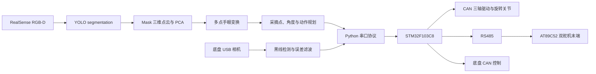

# 四自由度圣女果采摘机器人室内演示系统

本目录是一套可复现实验室室内演示的完整代码快照，包含上位机视觉与流程控制、手眼标定、机械臂和底盘串口通信、STM32 控制程序、AT89C52 双舵机末端程序及预编译固件。

> 安全提示：本系统会控制机械臂、旋转关节、剪切刀片和移动底盘。第一次运行必须拆除刀片或断开执行器动力，在急停可触及、运动范围清空的条件下逐项验证。

## 主要功能

- 使用 YOLO segmentation 同时识别果梗和主茎，保存置信度阈值图与最终三维定位图。
- 将果梗 mask 中的对齐深度像素转换为三维点云，经过深度簇筛选、离群点过滤和 PCA 拟合得到 `P1/P2`，以线段中心作为剪切定位点。
- 根据果梗方向生成带符号末端角度，并将机械旋转限制在 `[-90°, +90°]`。
- 使用 12 点刚体变换完成相机坐标系到机械臂坐标系的手眼标定，支持独立验证点。
- 在配置的三层扫描位执行检测和采摘；当前快照为 `X=7 cm`、`Y=45 cm`、`Z=1/21/41 cm`。
- 末端旋转 `0x05` 与机械臂移动 `0x04` 可间隔 50 ms 启动并统一等待反馈。
- 支持剪切、X 轴安全回退、果梗释放区间约束以及多目标连续采摘。
- 支持单目底盘摄像头黑线循迹、起步稳定判定、误差滤波和 STM32 定时移动 ACK。
- 自动创建中文运行记录，保存控制台文本、检测图和 HTML 汇总。

## 系统架构



更详细的数据流见 [`docs/architecture.md`](docs/architecture.md)。

## 目录说明

```text
robot_4dof_demo_indoor/
├── host_pc/                         Python 上位机和生产模型
│   ├── main1.py                     整机入口：底盘、扫描、检测、采摘
│   ├── vision.py                    分割、点云、PCA、目标融合与可视化
│   ├── pick1.py                     采摘、预瞄、回退和释放流程
│   ├── robot.py                     0x04/0x05/0x06 串口协议与 ACK
│   ├── test8.py                     底盘循迹控制类
│   ├── config1.py                   现场参数和安全限制
│   ├── calibration.py               当前机器的正式手眼矩阵
│   ├── hand_eye_calibration_multi_point.py
│   │                                多点标定与独立验证脚本
│   ├── camera_probe.py              摄像头编号诊断
│   ├── run_recorder.py              控制台、图片和 HTML 运行记录
│   ├── best2.pt                     当前 YOLO segmentation 权重
│   └── requirements.txt             Python 依赖
├── firmware/
│   ├── stm32_arm_chassis_controller/ STM32F103C8 Keil 工程
│   └── end_effector_8051/             AT89C52 双舵机 Keil C51 工程
└── docs/
    ├── architecture.md
    ├── communication_protocol.md
    └── calibration_and_operation.md
```

## 硬件与软件

当前代码对应以下实验室配置：

- Windows 上位机，Python 3.9.13。
- Intel RealSense RGB-D 相机，彩色和深度流均为 `1280×720 @ 30 FPS`。
- 一台用于底盘循迹的普通 USB 摄像头。
- STM32F103C8，Keil MDK，STM32F10x 标准外设库。
- 三轴闭环步进驱动器、CAN 总线和末端旋转关节。
- AT89C52，Keil C51，两个 PWM 舵机和 RS485 通信。
- 上位机与 STM32 使用 `115200 8N1`；STM32 与 AT89C52 使用 `9600 8N1`。

## 安装上位机环境

1. 安装 Intel RealSense 驱动和 SDK，确认 RealSense Viewer 能同时打开彩色和深度流。
2. 安装 Python 3.9 64 位。建议使用当前验证过的 3.9.13。
3. 在 `host_pc` 目录创建独立环境并安装依赖：

```powershell
cd robot_4dof_demo_indoor\host_pc
py -3.9 -m venv .venv
.\.venv\Scripts\Activate.ps1
python -m pip install --upgrade pip
python -m pip install -r requirements.txt
```

4. 检查普通 USB 摄像头编号：

```powershell
python camera_probe.py
```

## 首次配置

所有现场可调参数集中在 `host_pc/config1.py`。至少核对：

| 参数组 | 关键参数 | 作用 |
| --- | --- | --- |
| 工作空间 | `X_MIN/X_MAX/Y_MIN/Y_MAX` | 上位机发送坐标前的安全限制 |
| 扫描位 | `SCAN_X/SCAN_Y_START/SCAN_Y_MAX/SCAN_Z_*` | 每个停车点的机械臂扫描路径 |
| 释放区 | `RETREAT_Y_*`、`RETREAT_Z_*` | 果梗允许释放的 Y/Z 区间和死区 |
| 视觉 | `MODEL_PATH`、`YOLO_CONF`、`MASK_*`、`POINT_CLOUD_*` | 模型、置信度和点云质量门槛 |
| 机械结构 | `STATIC_BLADE_TIP_OFFSET_CM`、`MOVING_BLADE_TIP_OFFSET_CM` | 刀尖相对旋转中心距离 |
| 旋转安全 | `END_EFFECTOR_ROTATE_LIMIT_DEG` | 末端绝对角度限制，当前为 90° |
| 串口 | `SERIAL_PORT`、`BAUDRATE` | STM32 串口配置 |
| 底盘 | `CHASSIS_CAMERA_INDEX`、`CHASSIS_*` | 循迹摄像头、滤波和定时移动参数 |

`calibration.py` 和 `config1.py` 都是机器相关文件。复制到另一台机器人后不能直接假定坐标正确。

## 手眼标定

相机安装位置、安装角度、旋转中心针或机械臂坐标基准发生变化后，执行：

```powershell
python hand_eye_calibration_multi_point.py
```

建议采集覆盖实际采摘工作空间的 12 个以上标定点，再采集至少 3 个不参与拟合的验证点。脚本生成候选 `calibration_generated.py`，不会自动覆盖正式 `calibration.py`；验证误差满足刀口容差后再人工替换。详细步骤见 [`docs/calibration_and_operation.md`](docs/calibration_and_operation.md)。

## 编译和烧录固件

- STM32：打开 `firmware/stm32_arm_chassis_controller/PRJ/STM32_CAN_CMD.uvprojx`，选择 STM32F103C8 后编译烧录。
- 末端 51：打开 `firmware/end_effector_8051/project.uvproj`，使用 Keil C51 编译并烧录 AT89C52。
- 两个目录的 `prebuilt/` 包含本快照的 `.hex`，但正式实验仍建议从当前源码重新编译并记录版本。

固件细节见各自目录中的 README。

## 运行顺序

1. 清空机器人运动范围，确认机械限位、急停和刀片防护。
2. 给底盘、步进驱动、旋转关节、末端和 STM32 上电。
3. 确认 CAN、RS485、RealSense、底盘摄像头和 `COM` 端口连接。
4. 先在断开刀片动力的状态下测试 `0x04/0x05/0x06` 及反馈。
5. 在 `host_pc` 目录启动：

```powershell
python main1.py
```

6. 观察启动信息是否成功加载 `best2.pt`、打开 COM 口并启动 RealSense。
7. 任何坐标、角度、深度或 ACK 异常都应停止自动流程，先检查记录再恢复。

## 运行记录

`main1.py` 启动时会在 `host_pc/运行记录/` 创建带时间戳的目录，保存：

- 控制台日志；
- YOLO 置信度阈值图；
- 最终三维定位图；
- HTML 汇总报告。

该目录默认被 Git 忽略。复现实验时，应在论文或实验数据存储位置单独归档，而不是提交到源码仓库。

## 通信和反馈语义

完整协议见 [`docs/communication_protocol.md`](docs/communication_protocol.md)。特别注意：

- `0x04` 成功 ACK 表示需要运动的三轴已经收到驱动器 CAN 到位反馈。
- `0xE4 + status` 表示机械臂 CAN 发送或等待到位超时，应立即解析状态位。
- `0x05` 当前表示 STM32 已把旋转命令下发，不是带编码器闭环验证后的物理到位 ACK。
- `0x06` 当前是在 RS485 下发后固定等待约 1 秒返回，也不是刀片位置传感器反馈。
- Python 支持 `0x05` 负角度，禁止把负角度强制改成正数。

## 已知限制

- 当前手眼矩阵只适用于本快照对应的相机安装和机械坐标系。
- `best2.pt` 的类别名称必须与 `config1.py` 的果梗和主茎类别映射一致。
- 细果梗深度质量仍受 RealSense 材质、边缘、遮挡和环境光影响；代码通过整条 mask 点云而非单像素深度降低该问题。
- 旋转和舵机 ACK 目前不是独立物理到位传感器反馈。
- 自动流程不能替代机械限位、急停、硬件互锁和现场监护。

## 发布快照来源

- 上位机：实验目录 `to1.1/to1.1` 的正式运行文件。
- STM32：`通讯测试3.4`，包含机械臂 CAN 突发发送与底盘保活协调修复。
- 末端控制器：`6_双舵机 _外接四按键_RS485通讯_v2.1_适配v1`。
- 生产模型：`best2.pt`。
- 未收录：虚拟环境、旧模型、运行记录、论文 PDF、训练数据、临时脚本和 Keil 编译缓存。

快照日期：2026-07-25。
